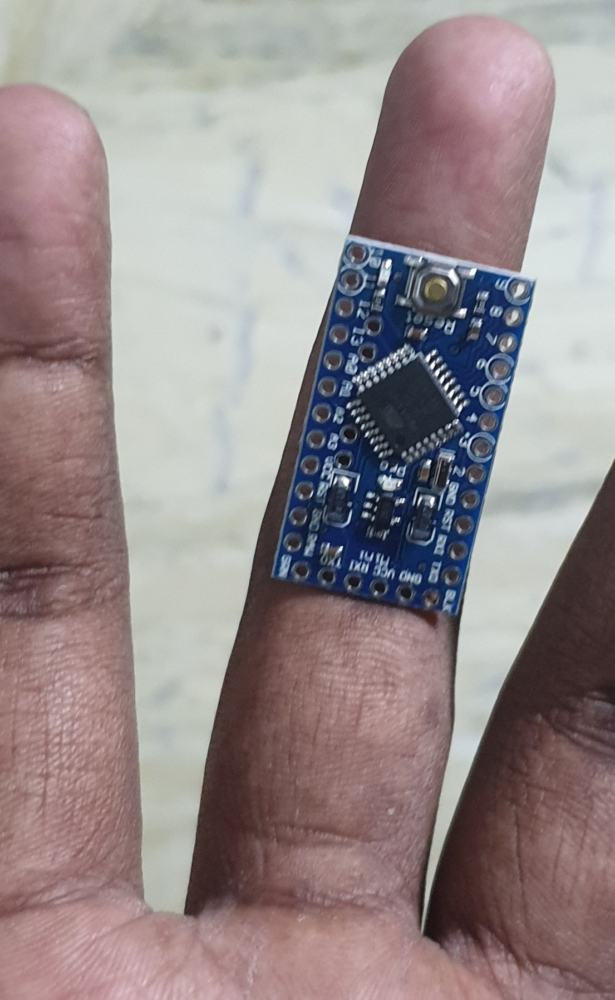
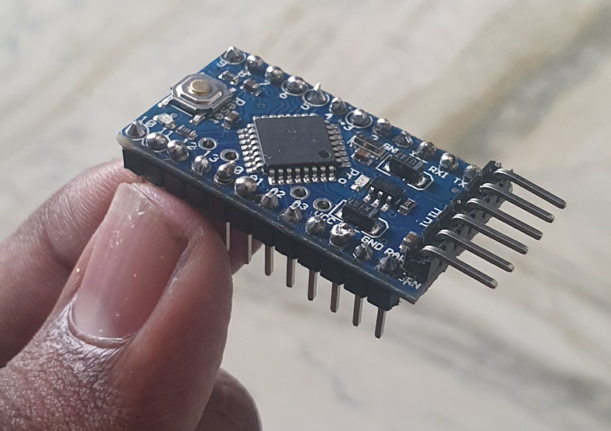
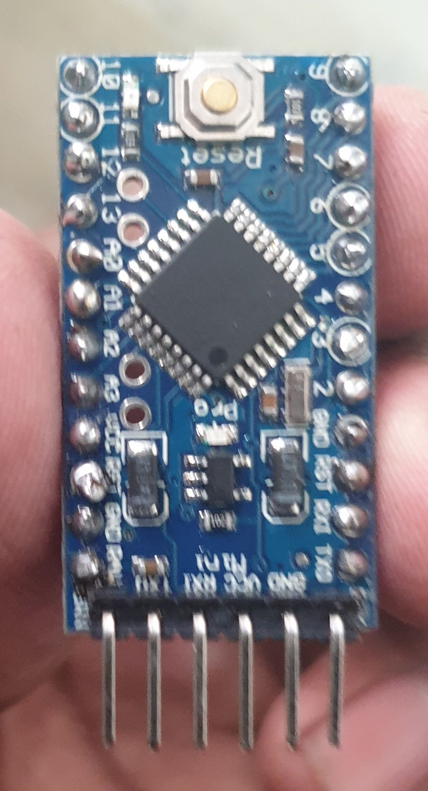
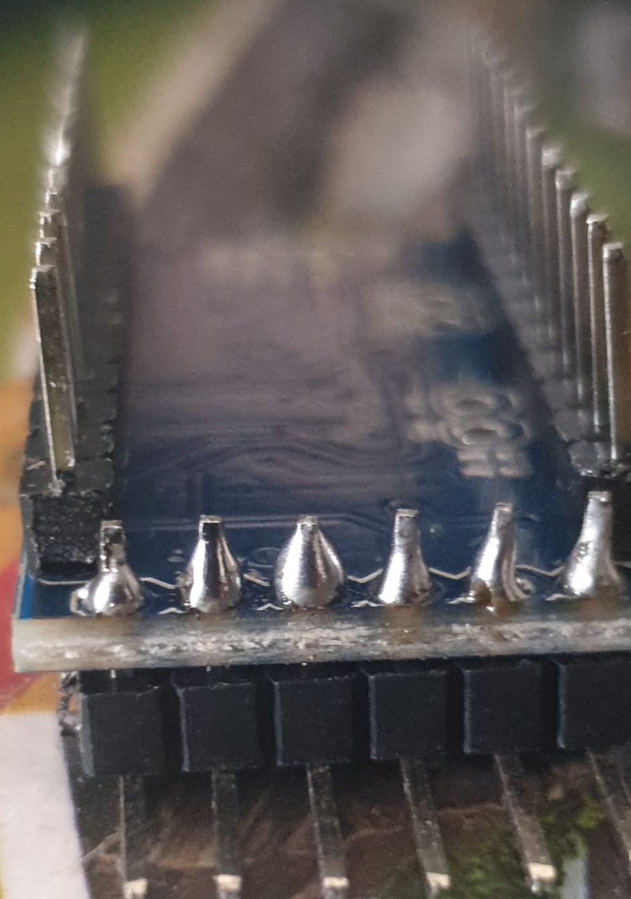
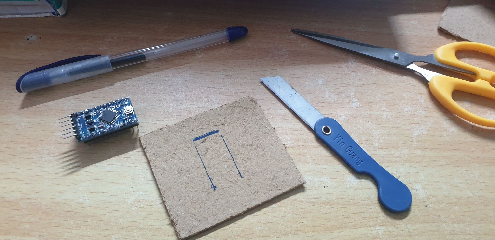
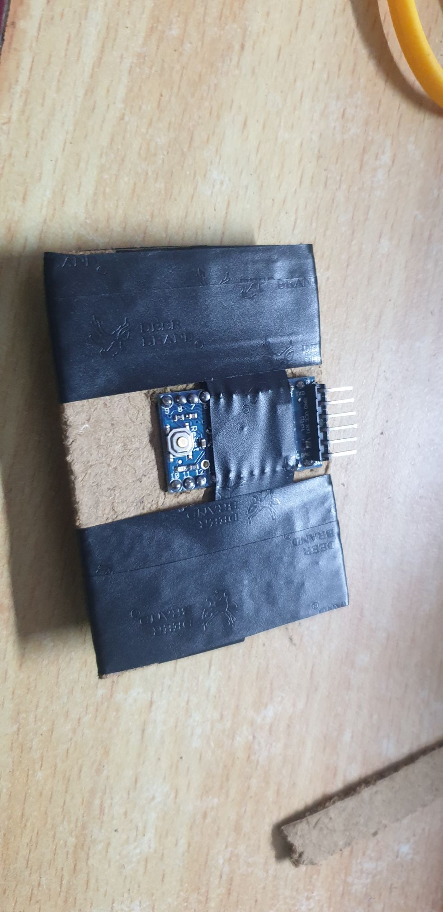
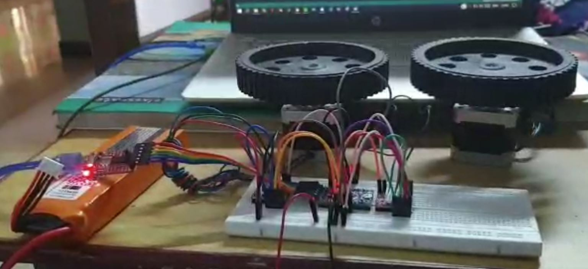
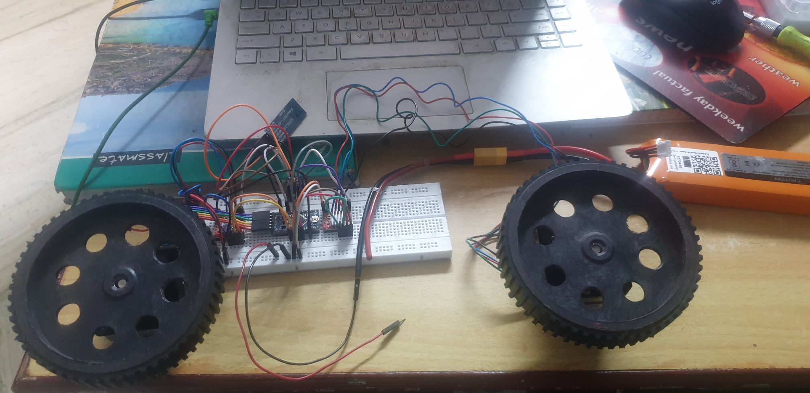
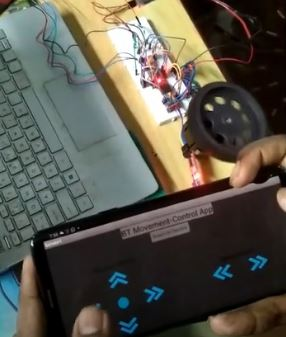

# Projects with Arduino Pro Mini

The mini does not contain a USB port. We need an FTDI for programming it (or flashing your program on it). I am using an [FTDI232 USB to UART IC](https://robu.in/product/ft232rl-usb-to-ttl-5v-3-3v-download-cable-to-serial-adapter-module-for-arduino/) that I bought on robu.in

***

## Soldering:

The pro mini did not come with the pins attached, I had to solder them as shown in the images below.

## Modules:

1. Setting up: (folder named intro)
    * This module covers the basics of interfacing with the mini.
    * This serves as an usage guide for the FTDI that we need for programming the arduino mini.
    * [Datasheet](http://www.ftdichip.com/Support/Documents/DataSheets/ICs/DS_FT232R.pdf)

2. Walking bot: (folder named walking bot)
    * This module contains files related to my first actual project with the pro mini.
    * A simple robot capable of walking, made using arduino pro mini, two 9v batteries and four sg90 servos.
    * 
  
3. Drving two NEMA17 motors: (folder named nema17)
    * This module is for driving two NEMA17 motors (4.2 kg-cm) simultaneously with arduino pro mini.
    * The motors and the drivers are powered with a 11.1V Li-Po battery.
    * 

4. Controlling motors with app: (folder named app+nema)
    * This is a test with my bt app, to control the motors with mobile.
    * App built in MIT app inventor and sends text commands over bluetooth.
    * 